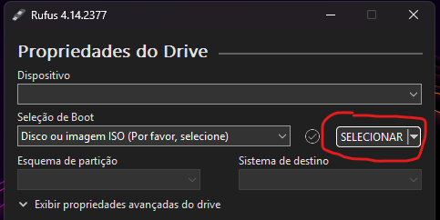
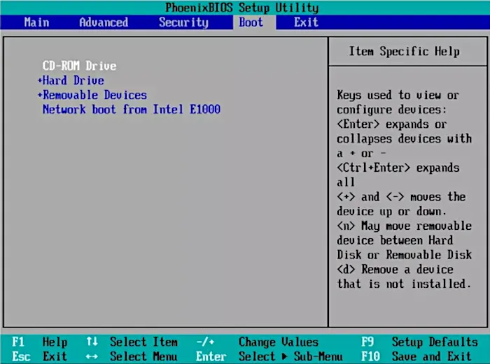
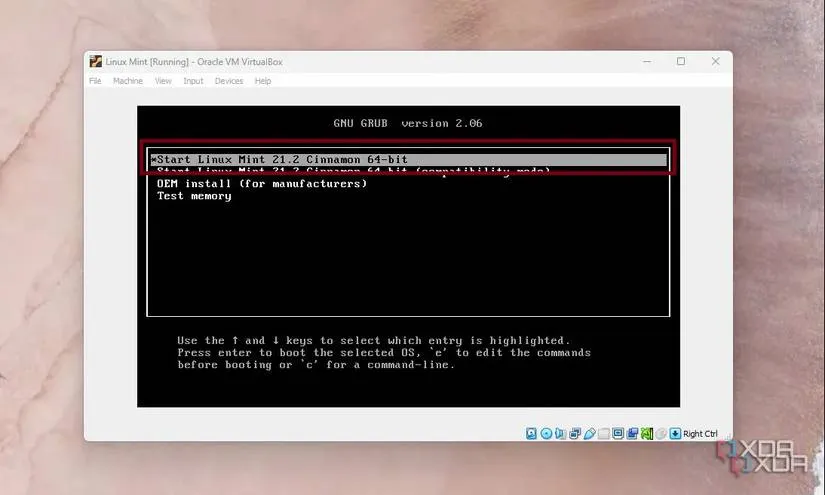
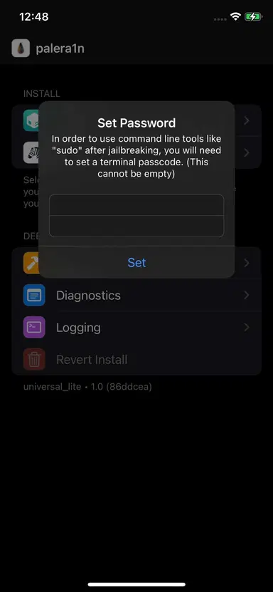
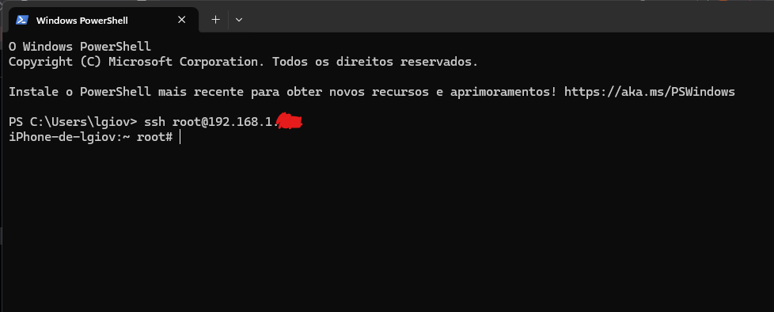

# Webcam iPhone para Windows (10/11)
Automação para transformar um iPhone antigo em uma webcam estática para Windows.

Este projeto utiliza um script em PowerShell no Windows para monitorar softwares de vídeo (Zoom, OBS, Meet, Discord) e enviar comandos via SSH para o iPhone. A tela do aparelho liga, desbloqueia e abre a câmera automaticamente apenas quando requisitado, desligando e economizando bateria logo em seguida.

## Aviso importante
Este projeto exige que o dispositivo iOS tenha Jailbreak. Prossiga por sua conta e risco. Como o aparelho será usado como uma webcam fixa e dedicada, não é recomendado realizar este procedimento no seu celular de uso pessoal e diário.

## Como funciona
1. Abra o seu aplicativo de preferência de vídeo
2. O script manda uma notificação pedindo que você aperte o botão Home do iPhone
3. Ao clicar, a câmera inicia automaticamente.
4. Ao fechar seu app de vídeo, a câmera fecha.

## Como executar
### Requisitos:
1. Um iPhone antigo ([Veja os dispositivos compatíveis](https://docs.website-msw.pages.dev/docs/reference/compatibility-chart/))
2. Cabo Lightning (de preferência Lightning para USB A)
3. Um computador com processador Intel
   
    3.1 Um pendrive com pelo menos 8GB, se tiver apenas um PC com Windows
   
### 1. Jailbreak
*Nota: O método pode variar dependendo da sua versão do iOS e modelo do aparelho. Este guia foca no método utilizado para o iOS 15 e em um iPhone SE (1ª Geração)*

- **Processador AMD:** É fortemente recomendado utilizar um computador com o processador Intel no processo de jailbreak, pois os processadores AMD dão muitos problemas na hora de executar o código para o iPhone. Nos meus testes, apenas funcionou quando utilizei um computador com Intel.

#### Se tiver apenas um PC com Windows:
1. Baixe a ferramenta [Rufus](https://rufus.ie/pt_BR/), para criar um pendrive bootável.
2. Baixe também uma distro Linux, de preferência, o [Mint](https://linuxmint.com/edition.php?id=326)
3. Conecte seu pendrive no computador e inicie o Rufus
4. Em Dispositivo, selecione seu pendrive, escolha Seleção de Boot e faça o upload da iso do Linux:

5. Aperte em Iniciar e siga as recomendações que o Rufus disser.
6. Após concluir essa etapa, conecte este pendrive em um computador com Windows e processador Intel (pode manter em seu computador se ele já atender esses requisitos).
7. Ligue (ou reinicie) o computador e entre na BIOS da sua placa mãe (Fique apertando Delete, F1 ou F2 até abrir uma tela com informações da sua placa mãe, parecida com essa:)

8. Navegue até BIOS e procure por alguma opção relacionada a selecionar o dispositivo de boot (Select Boot Device)
9. Coloque seu pendrive no topo da lista (geralmente através das setas ou F5 e F6)
10. Vá até a seção de Exit e saia. Seu computador irá reiniciar.
11. Ao reiniciar, irá aparecer uma tela do Linux Mint (Se optou por instalar o Mint):

12. Selecione Start Linux Mint e o sistema operacional irá iniciar.

#### No Linux
1. Abra o Terminal
2. Execute este comando para instalar o Palera1n:
```bash
sudo /bin/sh -c "$(curl -fsSL https://static.palera.in/scripts/install.sh)"
```
3. Após instalar, execute:
```bash
sudo palera1n -f
```
4. Conecte seu iPhone no computador e siga as instruções do palera1n para fazer o jailbreak no iPhone.
5. Se der tudo certo, seu iPhone vai receber os códigos e ficará assim:
[iphone brickando](docs/iphone-brickando.jpg)
6. Após esse processo, o celular irá iniciar normalmente e aparecerá um app do palera1n:

7. Abra ele e aperte em Install e selecione o Sileo.
8. Coloque uma senha para quando formos colcoar o comando `sudo`:

9. Após isso, o app Sileo aparecerá na sua página inicial:

Para mais informações, acesse a documentação oficial do [palera1n](https://docs.website-msw.pages.dev/docs/get-started/installing-palera1n-linux/).

### 2. Instalação de dependências
1. Abra o Sileo, vá na aba de fontes e clique no +:

2. Adicione as seguintes fontes (cole essas urls e aperte em Adicionar Fonte):
- `https://repo.chariz.io/`
- `https://havoc.app/`

3. Vá em Procurar e busque esses pacotes e instale:
- OpenSSH (Repo: Chariz)
- NewTerm 2 (Repo: Chariz)
4. Vá nas Configurações do iPhone e vá em Wi-FI
5. Aperte no *i* do lado do nome da sua rede
6. Desça até o final da página e procure por Configurar IP e selecione Manual:

7. Coloque um novo IP e a máscara de sub-rede:

8. Abra o NewTerm:

9. Digite `passwd root` e defina uma nova senha (a senha atual é *alpine*)
10. Altere a senha também para o user mobile: `passwd mobile`

### 3. Configurações de ambiente
#### No computador onde ficará sua webcam:
1. Abra o PowerShell
2. Digite esse comando para criamos uma chave SSH (responda Enter para todas as perguntas):
```bash
ssh-keygen -t ed25519
```
2. Conecte-se ao iPhone via SSH, usando o IP fixo definido anteriormente:
```bash
ssh root@192.168.1.XXX //troque pelo seu ip
```
3. Insira a senha que você definiu anteriormente no NewTerm
4. Após isso, você terá acesso ao seu iPhone pelo seu pc:

5. Instale as dependências necessárias:
```bash
apt-get update && apt-get install -y uikittools notifyutil
```
6. Após instalar, digite `exit` para voltar ao seu PC
7. Digite este comando para enviar sua chave SSH para o iPhone (ele pedirá sua senha pela última vez):
```bash
cat ~/.ssh/id_ed25519.pub | ssh root@192.168.1.XXX "mkdir -p ~/.ssh && chmod 700 ~/.ssh && cat >> ~/.ssh/authorized_keys && chmod 600 ~/.ssh/authorized_keys"
```

### 4. Configurar seu app de vídeo no iPhone
É necessário baixar no celular um app que transmita o vídeo para o computador, seja por Wi-Fi ou por cabo, como Iriun Webcam, DroidCam, EpocCam, etc.
#### Iriun Webcam
O script original já está pronto para este app, então pode pular essa parte.
#### Outros apps
1. Conecte-se ao iPhone via SSH no terminal novamente
2. Procure o app usando o esse comando `find`, subustituindo `NOME_DO_APP` pelo nome do seu app (ex: camo, epoc, epoccam):
```bash
find /var/containers -name "*.app" -maxdepth 5 | grep -i NOME_DO_APP 2>/dev/null
```
3. Se ele encontrar, retornará um caminho longo pareceido com esse `/var/containers/Bundle/Application/XXXXX/NOME.app`. Se não encontrar, troque o `NOME_DO_APP` por outras alternativas
4. Utilize o caminho que encontrou para encontrar o bundle ID:
```bash
cat /COLE_O_CAMINHO_AQUI/Info.plist | grep -A1 "CFBundleIdentifier"
```
5. Anote o valor `<string>` que aparecer (ex: com.reincubate.camo). Este é o seu Bundle ID.
6. Abra o aplicativo no seu iPhone, digite no terminal esse comando e copie o nome exato do processi que aparecer na lista:
```bash
ps aux | grep -i NOME_DO_APP
```
7. Após isso, para testar se está funcionando, coloque esses comandos ainda no terminal do seu pc:
- Para abrir o app: `uiopen --bundleid SEU_BUNDLE_ID`
- Para fechar o app: `killall NOME_DO_PROCESSO`
Se o app abrir e fechar corretamente, podemos partir para o próximo passo.

